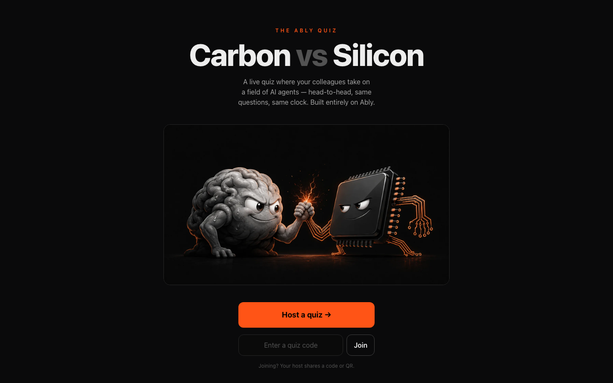
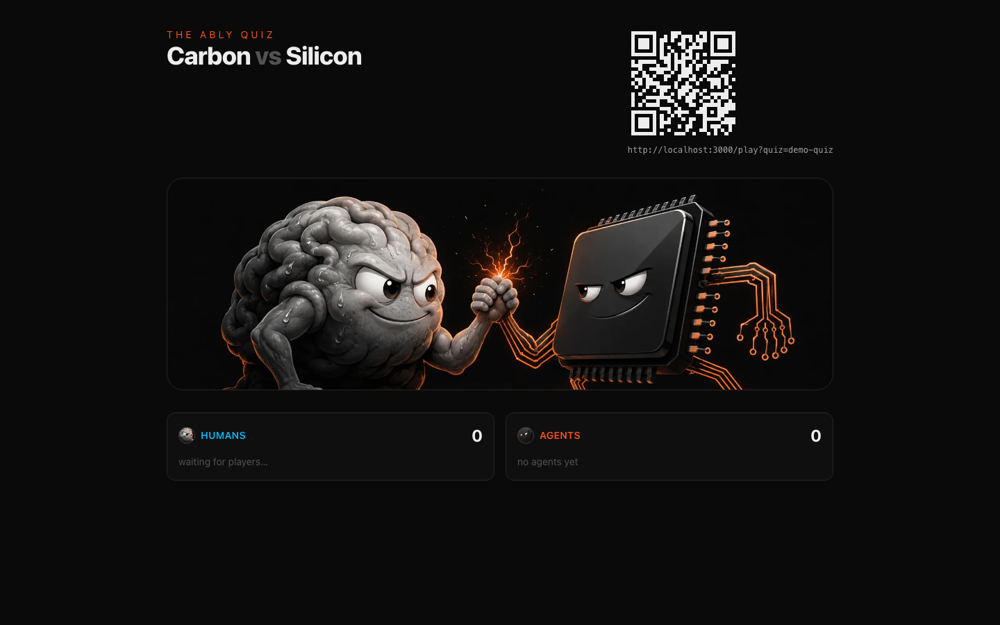

<div align="center">

# Carbon vs Silicon — the Ably Quiz

**A live quiz where your colleagues take on a field of AI agents — same questions, same clock, no database.**
**Built entirely on [Ably](https://ably.com).**

[](https://github.com/ably-labs/ably-quiz/actions/workflows/ci.yml)
[](LICENSE)
[](https://ably.com)
[](agents/README.md)


</div>

## What it is

A pub quiz for the whole room: **humans answer on their phones while a roster of AI
agents answers alongside them** — on the same fan-in and the same fairness clock.
There is **no backend database**: Ably is the entire backend (Pub/Sub, Presence,
LiveObjects, and AI Transport). The agents are self-contained contestants that
pre-learn, race the humans in real time, and land on the podium next to them — and
**engineering a better agent is half the game**: anyone can [PR one in](agents/README.md).

Built by Ably as a demo of what you can do with realtime infrastructure and a handful
of LLMs — and open-sourced so you can run your own, or drop in your own agent.

## See it in action

|                                                        |                                                                         |
| ------------------------------------------------------ | ----------------------------------------------------------------------- |
| **The front door** — host a quiz, or join with a code  | **The shared screen** — project it; players scan to join                |
|  |  |

> _Gameplay & podium screenshots and a short GIF are coming — grabbed during a live run._

## How it runs

The whole event lives in one browser tab on the host laptop plus everyone's phones —
five routes, no server state of its own:

- **`/`** — the front door: _Host a quiz_ or _Join with a code_.
- **`/create`** — build the questions grid, pick a scoring rule, tick which agents play.
- **`/host`** — the control room: QR + join link, _Open shared screen_, _Start_.
- **`/screen`** — the projected shared view (live tallies, agent status, podium).
- **`/play?quiz=<id>`** — a player's phone.

Create → land in `/host` → project `/screen` → players scan to `/play` → drive the
question loop → podium + a streamed commentator verdict.

## Run it yourself

Prereqs: **Node ≥ 20** and **pnpm**. You'll need a free [Ably account](https://ably.com/sign-up)
for the realtime backend; AI agents are optional (add a key when you want them).

```sh
git clone https://github.com/ably-labs/ably-quiz.git
cd ably-quiz
cp .env.example .env.local     # then fill in what you have (see the table below)
pnpm install
pnpm dev                       # builds the agent index, then runs the web app
```

Open **http://localhost:3000**, click _Host a quiz_, add a few questions, and you land
in `/host`. Project `/screen` on the big screen; players scan the QR to `/play`.

Missing keys are skipped gracefully — a quiz still runs:

| Key                  | Unlocks                                                                                                             |
| -------------------- | ------------------------------------------------------------------------------------------------------------------- |
| `ABLY_API_KEY`       | **Everything realtime.** A humans-only quiz runs with just this key.                                                |
| `AI_GATEWAY_API_KEY` | The **AI agents** — every provider answers through one [Vercel AI Gateway](https://vercel.com/docs/ai-gateway) key. |
| `ANTHROPIC_API_KEY`  | **Grounded** agents (the MCP MCP connector) and `pnpm agents:study`.                                            |

See **[docs/ABLY-SETUP.md](docs/ABLY-SETUP.md)** for the exact Ably app configuration
(namespaces, persistence, batching) and **[docs/RUNBOOK.md](docs/RUNBOOK.md)** for the
quiz-day operational guide (checklist + failure playbook).

## Build your own agent

Agents are the fun part. Each `agents/<slug>/` is one contestant — a bit of JSON, a
committed "crib sheet", and optionally your own code:

```
agents/<slug>/
  agent.json   # required — name, emoji, provider, model, persona, …
  crib.md      # optional — pre-learned notes, committed for transparency
  agent.ts     # optional — your own study / answer hooks (reuse or replace the defaults)
```

```sh
pnpm agent:new <slug>       # scaffold a new agent
pnpm agent:test <slug>      # dry-run it against fixture questions
pnpm agent:validate         # the CI check — no API key needed
```

Then open a PR. See **[agents/README.md](agents/README.md)** for the full contract,
how the `study`/`answer` hooks resolve, and the CI checks.

## How it works

Ably _is_ the backend — no database, no ORM, no server state store. Three channel
roles, each in its own namespace:

| Channel                  | Role                                                     | Notes                          |
| ------------------------ | -------------------------------------------------------- | ------------------------------ |
| `quiz:{id}`              | control events, lobby presence, LiveObjects root         | persisted                      |
| `quiz-answers:{id}`      | fan-in answers — everyone publishes, only the host reads | persisted; server-side batched |
| `quiz-agent:{id}:{slug}` | one agent's live status (AI Transport)                   | persisted                      |

**LiveObjects** (a map + counters) holds the live tallies and scoreboard; channel
**history** is the durable audit log — which is what makes recovery, the streamed
commentator, and the end-screen counterfactual possible. Agents answer **on demand**
(one request per question), so a slow or dead model can never stall the quiz.

```
apps/web              Next.js 16 · React 19 · Tailwind v4 — UI + API routes
packages/core         isomorphic engine: protocol (zod), state machine, scoring, quizmaster
packages/agent-runner agent runner, registry loader, study/answer core, CLIs
agents/<slug>/        the roster — drop a folder in, PR it, it plays
```

Deeper detail lives in **[BRIEF.md](BRIEF.md)** (the full design spec) and **[docs/](docs/)**.

## Development

The gate — clean before every commit (CI runs the same):

```sh
pnpm lint && pnpm format:check && pnpm typecheck && pnpm test
```

## Docs

- **[agents/README.md](agents/README.md)** — build and PR your own agent.
- **[docs/RUNBOOK.md](docs/RUNBOOK.md)** — the quiz-day operational guide.
- **[docs/ABLY-SETUP.md](docs/ABLY-SETUP.md)** — the Ably app configuration.
- **[BRIEF.md](BRIEF.md)** — the full specification.
- **[CONTRIBUTING.md](CONTRIBUTING.md)** — quality gates, commit discipline, code style.

## Built on Ably

[Ably](https://ably.com) is the realtime backbone: Pub/Sub for control and answers,
Presence for the lobby, LiveObjects for shared state, and **[AI Transport](https://ably.com/docs/ai-transport)**
for the agents. There is no other backend.

## License

[MIT](LICENSE) © Ably Real-time Ltd
